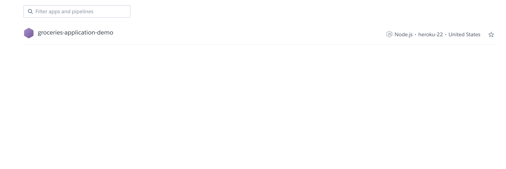
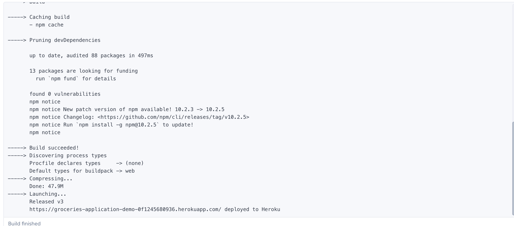

# Week 7 - Heroku

- As discussed in the video, the current status of the app should deploy to Heroku.
- Capture the screenshots of each tab or screencast, walking through the flow of each tab.


## Directions
```bash
# install on Mac
brew tap heroku/brew && brew install heroku
# login
heroku login

mkdir heroku-groceries
cd heroku-groceries
git init
heroku git:remote -a groceries-application-demo
git add .
git commit -m "add server"
git push heroku master
```

## Example


